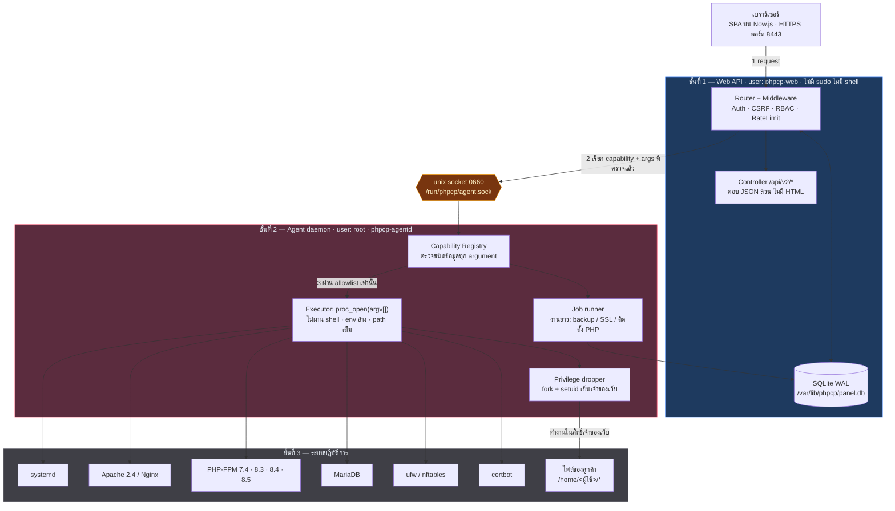

# BluPanel — สถาปัตยกรรมระบบ

> เอกสารออกแบบระดับ Production
> Stack: PHP vanilla ไร้ dependency — ต้องการ **PHP 8.2 ขึ้นไป** (ใช้ `readonly class`)
> ตัวติดตั้งลง PHP 8.4 ให้ · เป้าหมาย: ปลอดภัย เร็ว เบา แจกจ่ายติดตั้งได้หลายเซิร์ฟเวอร์
> ชื่อโค้ดเนมภายใน (บัญชีระบบ ไบนารี เส้นทางไฟล์): **phpcp**

---

## 1. หลักการออกแบบที่ตัดสินใจแล้ว

| ข้อ | การตัดสินใจ | เหตุผล |
|---|---|---|
| D1 | **แยกสิทธิ์ 3 ชั้น** — เว็บไม่มีสิทธิ์ root เด็ดขาด | ช่องโหว่ใน UI ต้องไม่กลายเป็น root shell |
| D2 | **Agent daemon เป็น PHP CLI** สื่อสารผ่าน unix socket | ไม่เพิ่มภาษา/runtime ใหม่ ใช้ `pcntl`+`posix` ที่มีอยู่แล้ว |
| D3 | **capability แบบ typed เท่านั้น** ห้ามส่ง shell string | ตัด command injection ที่ต้นทางเชิงโครงสร้าง ไม่ใช่ด้วยการ escape |
| D4 | **SQLite (WAL) เก็บ state ของ panel** | panel เป็นคนคุม MariaDB จึงห้ามพึ่งพา MariaDB — MariaDB ล่มแล้ว panel ต้องยังเข้าได้เพื่อกดสั่ง start |
| D5 | **1 บัญชีโฮสติ้ง = 1 system user = 1 บ้าน = 1 PHP-FPM pool ต่อเวอร์ชัน PHP** · **แก้ 2026-08-06 (migration 0006):** เดิมเป็น "1 เว็บไซต์ = 1 uid" | ลูกค้าโดนแฮ็ก 1 ราย ต้องอ่านไฟล์ของลูกค้ารายอื่นไม่ได้ · หน่วยที่ขายจริงคือบัญชี ไม่ใช่เว็บ โควตาและ SFTP จึงต้องผูกกับบัญชี → [§11](#11-การแยกเว็บไซต์ออกจากกัน-multi-tenant-isolation) |
| D6 | **ไม่มี build step, ไม่มี CDN, ไม่มี npm** — ไลบรารีฝั่งหน้าเว็บ commit เข้า repo พร้อม SHA256SUMS | ติดตั้งบนเซิร์ฟเวอร์ปิด/ไม่มีเน็ตได้ + CSP เข้มได้ + supply chain ตรวจสอบได้ · **แก้ 2026-08-05:** ยังไม่มี build step เหมือนเดิม แต่ตั้งแต่ PLAN-V2 เฟส C จะมีไลบรารีภายนอกหนึ่งตัว (Now.js) ที่ commit ไฟล์ dist เข้า repo — ไม่ใช่ "เขียนเองทั้งหมด" อีกต่อไป ดู [PLAN-V2 §2 N8](PLAN-V2.md#2-การตัดสินใจเชิงสถาปัตยกรรม-ตัดสินแล้ว) |
| D7 | ~~Server-rendered HTML + JS ปรับปรุงทีหลัง~~ → **SPA บน Now.js คุยกับ `/api/v2/*` ที่เป็น JSON ล้วน** · **แก้ 2026-08-08 (PLAN-V2 เฟส C/D)** | เหตุผลเดิม (TTFB ต่ำ เบากว่า) ยังจริง แต่แลกกับ Controller 17 ตัวที่ผสมการคำนวณกับการเรนเดอร์ HTML ไว้ในฟังก์ชันเดียว · ตอนนี้ฝั่ง PHP ไม่ echo HTML ที่ไหนเลยนอกจาก `ErrorPage` → [§9](#9-frontend--เบาจริง-ไม่มี-build-step) |
| D8 | **SSE สำหรับ metrics สด** ไม่ใช้ WebSocket | ทางเดียวพอ ไม่ต้องมี server เพิ่ม ผ่าน reverse proxy ง่าย |
| D9 | **Driver layer สำหรับ web server** | v1 ส่ง Apache, v1.1 เพิ่ม Nginx โดยไม่ต้องรื้อ |
| D10 | **ตรวจ config ก่อน reload ทุกครั้ง** | เขียน vhost ผิดแล้ว reload = เว็บทั้งเครื่องดับ |
| D11 | **panel มี web/PHP stack ของตัวเองแยกจากที่บริหาร** | สั่งหยุด Apache ของระบบแล้ว panel ต้องยังเข้าได้เพื่อสั่ง start กลับ → [§5](#5-การแยก-service-ของ-control-panel-ออกจาก-service-ที่บริหาร) |
| D12 | **3 โหมด: production / sandbox / dryrun** | ทดสอบเต็มรูปแบบบนเครื่องนักพัฒนาได้โดยไม่แตะระบบจริง → [§6](#6-โหมดการทำงาน--ใช้จริง--ทดสอบ--จำลอง) |
| D13 | **Multi-PHP & Web/DNS Core Infrastructure** | รองรับ PHP 7.4 & 8.4 สวมคู่กับ Apache2 + Nginx Proxy, BIND9 DNS, MariaDB, OpenSSH, UFW, Fail2ban |
| D14 | **Mail hosting — ✅ ทำแล้ว** (Postfix + Dovecot + rspamd, DKIM/SPF/DMARC/MX สร้างอัตโนมัติ) | กล่องจดหมายจริงบนเครื่อง อ่านผ่าน IMAP ได้ · ขอบเขตที่ตกลงไว้และสิ่งที่ยัง**ไม่**ทำ (เว็บเมล, CalDAV, Sieve, ClamAV) อยู่ใน [PLAN-MAIL.md](PLAN-MAIL.md) |

---

## 2. แผนภาพสถาปัตยกรรม



**กฎเหล็กข้อ 1:** ลูกศรจากชั้น 1 ไปชั้น 3 **ไม่มี** ทุกอย่างต้องผ่านคอขวดที่ตรวจชนิดข้อมูลที่ชั้น 2

**กฎเหล็กข้อ 2:** Apache / PHP-FPM / MariaDB ในชั้นที่ 3 คือของ **ระบบที่ถูกบริหาร** เท่านั้น ตัว panel เองไม่ได้อาศัยมันรัน — panel มี instance ของตัวเองแยกต่างหาก ดู [§5](#5-การแยก-service-ของ-control-panel-ออกจาก-service-ที่บริหาร)

---

## 3. ชั้นที่ 1 — Web UI

### 3.1 ผู้ใช้และการรัน

รันบน **FPM master ของตัวเอง** (`phpcp-fpm.service`) ไม่ใช่ pool ในระบบ — เหตุผลอยู่ใน [§5](#5-การแยก-service-ของ-control-panel-ออกจาก-service-ที่บริหาร)

```ini
; /etc/phpcp/fpm/pool.d/panel.conf   ← config tree ของ panel เอง
[panel]
user = phpcp-web
group = phpcp                      ; group เดียวกับ socket ของ agent
listen = /run/phpcp/panel-fpm.sock
pm = static
pm.max_children = 4                ; panel มีผู้ใช้ไม่กี่คน ไม่ต้องเยอะ

php_admin_value[open_basedir]  = /usr/share/phpcp/:/etc/phpcp/:/var/lib/phpcp/:/var/log/phpcp/:/run/phpcp/:/var/lib/phpcp/tmp/
php_admin_value[disable_functions] = exec,passthru,shell_exec,system,proc_open,popen,pcntl_exec,pcntl_fork,posix_setuid,dl
php_admin_flag[allow_url_fopen] = off
php_admin_value[upload_tmp_dir] = /var/lib/phpcp/tmp
php_admin_value[memory_limit] = 128M
```

ตัวเลขในไฟล์นี้ (`memory_limit`, `upload_max_filesize`, `post_max_size`, `max_execution_time`,
`pm.max_children` และอีกไม่กี่ตัว) **ผู้ดูแลตั้งเองได้จากหน้าตั้งค่า** ผ่าน `panel.php_set` ซึ่ง
แก้เฉพาะบรรทัดเหล่านั้นในไฟล์ที่ตัวติดตั้งเขียนไว้ แล้วเขียน `LimitRequestBody` ของ Apache ฝั่ง
panel ให้ตรงกันในทรานแซกชันเดียว — สามเพดานนั้นจำกัดการอัปโหลดเดียวกันและตัวเล็กที่สุดชนะ ·
ตารางค่าตั้งคือแหล่งความจริง ไฟล์คือผลลัพธ์ ตัวติดตั้งจึงเรียก `phpcp panel:php-apply` ทุกครั้ง
หลังอัปเดต เพราะขั้นตอนติดตั้งสร้าง `panel.conf` ใหม่จากเทมเพลตเสมอ

`open_basedir` กับ `disable_functions` **ไม่อยู่ในรายการที่ตั้งได้** และจะไม่มีวันอยู่ — สองบรรทัดนี้
คือขอบเขตของชั้นที่ 1 ทั้งหมด หน้าจอที่ขยายมันได้คือหน้าจอที่ยกเลิกการแยกชั้นได้ในคลิกเดียว

`/run/phpcp/` ต้องอยู่ใน `open_basedir` ด้วยเพราะ `Agent\Client` ต่อ agent ผ่าน `stream_socket_client('unix://…')` ซึ่งอยู่ใต้กฎเดียวกับการอ่านไฟล์ · tmp ของ panel อยู่ใต้ `/var/lib/phpcp/` ไม่ใช่ `/tmp` เพราะ `/tmp` ถูกล้างตอนบูตแล้ว `ReadWritePaths` ของ systemd จะหาไม่เจอจน unit สตาร์ตไม่ขึ้น

`disable_functions` ปิด `proc_open`/`exec` **ที่ตัว panel เอง** — ต่อให้มีช่องโหว่ RCE ในโค้ด PHP ของ panel ก็สั่ง shell ไม่ได้ ทำได้แค่เรียก capability ที่ agent อนุญาต ซึ่งถูกจำกัดและถูก audit ครบ

### 3.2 โครงสร้างคำขอ

```
public/index.php
  └─ Bootstrap
       ├─ Config (อ่าน /etc/phpcp/config.php ครั้งเดียว, opcache แคช)
       ├─ Router          จับคู่ path → controller (array ธรรมดา ไม่มี regex ซ้อน)
       └─ Middleware pipeline (ตามลำดับ)
            1. SecurityHeaders   CSP nonce, HSTS, X-Frame-Options: DENY
            2. RateLimit         token bucket ใน SQLite ต่อ IP + ต่อบัญชี
            3. Session           คุกกี้ __Host- , SameSite=Strict, rotate ทุก 15 นาที
            4. Auth              ยังไม่ล็อกอิน → 401 (2FA / บังคับเปลี่ยนรหัสก็ตอบเป็นรหัสสถานะ)
            5. Csrf              ตรวจทุก POST/PUT/DELETE
            6. Rbac              ตรวจ permission ของ route ต่อ role
            7. AuditContext      ผูก request id ให้ทุก action ที่จะเกิด
       └─ Controller → JSON
```

ชั้น Auth **ไม่เด้ง 302 อีกแล้ว** ตั้งแต่ลบ UI แบบ HTML — เส้นทางที่ต้องใช้สิทธิ์คือ
`/api/v2/*` ทั้งหมด และการเด้งใส่คำขอที่ยิงด้วย `fetch` ทำให้ฝั่งเรียกเห็น "สำเร็จพร้อม
HTML" แทนที่จะเห็นว่าไม่ได้ล็อกอิน แล้วพังในที่ที่ไกลจากต้นเหตุ · การพากลับหน้าเดิม
หลังล็อกอินเป็นงานของ router ฝั่งเบราว์เซอร์

Router เป็น array คงที่ ทำให้ opcache แคชได้ทั้งไฟล์ ไม่มีการ scan directory ตอน runtime

### 3.3 หน้าจอทั้งหมด (ตาม [PROMPT.md](history/PROMPT.md) — UI ภาษาไทยทั้งระบบ)

**ทุกหน้าอยู่ใน SPA** ที่ `/app/*` · ฝั่ง PHP มีเส้นทางหน้าเว็บอยู่ห้าเส้นเท่านั้น:
`/` (เด้งไป `/app/`) กับ `/app`, `/app/`, `/app/{page}`, `/app/{page}/` ซึ่งส่งไฟล์ shell
ตัวเดียวกันหมด · เส้นทางในตารางข้างล่างคือเส้นทางของ router ฝั่งเบราว์เซอร์
ส่วนสิทธิ์บังคับจริงที่ `/api/v2/*` ที่หน้านั้นเรียก

| กลุ่ม | หน้า | route | permission |
|---|---|---|---|
| — | แดชบอร์ด | `/app/` | `dashboard.view` |
| **HOSTING** | เว็บไซต์ | `/app/sites` · `/app/site?id={id}` · `/app/site-create` | `site.view` |
| | โดเมนและ DNS | `/app/domains` · `/app/domain?id={id}` | `domain.view` |
| | SSL Certificates | `/app/certificates` | `ssl.view` |
| | PHP | `/app/php-versions` | `php.view` |
| | ฐานข้อมูล | `/app/databases` | `db.view` |
| | ตัวจัดการไฟล์ | `/app/filemanager` (เปิดแท็บใหม่) | `file.view` |
| | งานอัตโนมัติ | `/app/cron-jobs` · `/app/cron-job?id={id}` | `cron.view` |
| | กล่องจดหมาย | `/app/mailboxes` | `mail.view` |
| | คิวเมลขาออก | `/app/mail-queue` | `settings.manage` |
| | สำรองข้อมูล | `/app/backups` · `/app/backup-destination` | `backup.view` |
| **SERVER** | ภาพรวมเซิร์ฟเวอร์ | `/app/server` | `server.view` |
| | Services | `/app/services` | `service.view` |
| | ความปลอดภัย | `/app/security` | `security.view` |
| | Firewall | `/app/firewall` | `firewall.view` |
| | SSH | `/app/ssh` | `ssh.view` |
| | Logs | `/app/logs` | `log.view` |
| | ผู้ใช้งานระบบ | `/app/users` · `/app/user?id={id}` · `/app/user-create` | `user.view` |
| | การตั้งค่าเซิร์ฟเวอร์ | `/app/settings` | `settings.view` |
| — | ล็อกอิน · 2FA · เปลี่ยนรหัสผ่าน · 403 | `/app/login` · `/app/login-2fa` · `/app/change-password` · `/app/forbidden` | — |

**role `webadmin` ไม่มี `cron.*` และ `backup.*`** ตั้งแต่ 2026-08-15 — งานตามเวลาของลูกค้า
ไปจบที่ crontab ของ*ระบบ* ซึ่งเป็นทรัพยากรของทั้งเครื่อง และเป็นทางที่ตรงที่สุดจากบัญชี
โฮสติ้งไปสู่การรันโค้ดซ้ำ ๆ โดยไม่มีใครดู · ลูกค้ายังเข้าถึงไฟล์สำรอง**ของตัวเอง**ได้
ตามปกติ เพราะไฟล์อยู่ที่ `<บ้าน>/backup` ซึ่งเปิดผ่านตัวจัดการไฟล์และ SFTP ได้

เมนูฝั่งเบราว์เซอร์ซ่อนรายการที่ผู้ใช้ไม่มีสิทธิ์ แต่นั่นเป็นเรื่อง UX ล้วน ๆ —
เทสต์ `RbacMatrix` ตรึงว่าทุกเมนูใช้สิทธิ์เดียวกับหน้าที่มันชี้ไป และทุกหน้าเรียก
API ที่บังคับสิทธิ์เต็มรูปแบบอยู่ดี

การแยก Hosting / Server บังคับที่ระดับ permission ไม่ใช่แค่ที่สายตา — role `ผู้ดูแลเว็บไซต์` ไม่มี permission ขึ้นต้นด้วย `service.` `firewall.` `ssh.` `user.` เลย เปิด URL ตรง ๆ ก็ได้ 403

### 3.4 กฎ UX ที่บังคับในโค้ด

ตาม [PROMPT.md](history/PROMPT.md) ข้อ "Important UX Rule" — หน้าเว็บไซต์แสดง `PHP Version: 8.4` เป็นข้อมูล แต่ปุ่มควบคุมโปรเซส PHP-FPM มีเฉพาะหน้า Services เท่านั้น
บังคับด้วย: capability `service.restart` ไม่ผูกกับ permission ใด ๆ ที่ role `ผู้ดูแลเว็บไซต์` มี ต่อให้หน้าเว็บไซต์เผลอเรนเดอร์ปุ่มออกมา คำสั่งก็ถูกปฏิเสธที่ชั้น 2

หน้า Services แสดงความสัมพันธ์ย้อนกลับ (จาก query SQLite ล้วน ไม่ต้องถาม OS):
```
PHP-FPM 8.4   ● ทำงานปกติ   เว็บไซต์ที่ใช้งาน: example.com, shop.com
MariaDB       ● ทำงานปกติ   ฐานข้อมูลที่ใช้งาน: example_db, shop_db
```

---

## 4. ชั้นที่ 2 — Agent daemon (`phpcp-agentd`)

### 4.1 หน้าที่

โปรเซส PHP CLI รันเป็น root ตัวเดียว ฟัง unix socket เป็นจุดเดียวในระบบที่ทำงานสิทธิ์สูงได้

```
/usr/share/phpcp/bin/phpcp-agentd
  ├─ ฟัง /run/phpcp/agent.sock  (0660 root:phpcp)
  ├─ รับ 1 request = JSON 1 บรรทัด { cap, args, actor, request_id }
  ├─ CapabilityRegistry::resolve(cap)      ← ไม่พบ = ปฏิเสธทันที ไม่มี fallback
  ├─ $capability->validate(args)           ← schema ต่อ capability
  ├─ AuditLog::write(...)                  ← เขียน "ก่อน" ลงมือทำ
  ├─ $capability->run()                    ← proc_open(array), timeout, ปิด stdin
  └─ ตอบ JSON { ok, data, code, duration_ms }
```

Concurrency: `pcntl_fork` ต่อ connection, จำกัดลูกไม่เกิน 16, timeout ต่องาน 30 วินาที (งานยาวย้ายเข้าคิว)

### 4.2 หัวใจความปลอดภัย — capability แบบ typed

**ไม่มีที่ไหนในระบบที่รับ shell string** ตัวอย่างการประกาศ:

```php
// src/Agent/Capability/ServiceRestart.php
final class ServiceRestart implements Capability
{
    public const NAME = 'service.restart';

    // allowlist ตายตัว — ชื่อ service มาจาก enum ไม่ใช่จาก input
    private const ALLOWED = [
        'apache2', 'nginx', 'mariadb', 'cron',
        'php7.4-fpm', 'php8.3-fpm', 'php8.4-fpm', 'php8.5-fpm',
    ];

    public function validate(array $args): array
    {
        $name = $args['service'] ?? '';
        if (!in_array($name, self::ALLOWED, true)) {
            throw new ValidationError('service ไม่อยู่ในรายการที่อนุญาต');
        }
        return ['service' => $name];
    }

    public function run(array $a, Executor $x): Result
    {
        // argv array → ไม่มี shell → ไม่มี injection แม้จะพยายามยัด ; หรือ $( )
        return $x->exec(['/usr/bin/systemctl', 'restart', $a['service']], timeout: 30);
    }
}
```

`Executor::exec()` บังคับ:
- `proc_open` ด้วย **array argv** เท่านั้น (PHP ข้าม `/bin/sh` ให้อัตโนมัติ)
- binary ต้องเป็น absolute path และผ่าน `is_executable()` + ตรวจว่าไม่ใช่ symlink ที่ชี้ออกนอก `/usr:/bin:/sbin`
- `env` ล้างเหลือ `PATH=/usr/sbin:/usr/bin:/sbin:/bin`, `LC_ALL=C`
- stdin ปิด, stdout/stderr จำกัด 1 MB, timeout บังคับ, เกินเวลา `SIGKILL`
- `cwd` กำหนดชัด ไม่ใช้ของที่สืบทอดมา

### 4.3 รายการ capability (ย่อ)

| หมวด | capability | หมายเหตุความปลอดภัย |
|---|---|---|
| service | `service.status` `.start` `.stop` `.restart` `.reload` | ชื่อ service จาก allowlist ตายตัว |
| site | `site.create` `.suspend` `.resume` `.delete` `.set_php` | ชื่อโดเมนผ่าน regex RFC 1123 + ตรวจซ้ำใน SQLite |
| webserver | `webserver.write_vhost` `.testconfig` `.reload` | เขียนไฟล์จาก **template + ค่าที่ escape แล้ว** ห้ามรับ config ดิบ |
| php | `php.list` `.ext_install` `.ext_remove` `.pool_write` | ชื่อ extension `^[a-z0-9_]{2,32}$` + ตรวจกับรายการ apt จริง |
| db | `db.create` `.drop` `.user_create` `.grant` `.dump` `.import` | ใช้ prepared statement ทั้งหมด, identifier ผ่าน allowlist regex |
| ssl | `ssl.issue` `.renew` `.remove` `.status` | เรียก certbot ด้วย argv, โดเมนต้องมีในระบบก่อน |
| file | `file.list` `.read` `.write` `.mkdir` `.move` `.delete` `.chmod` `.zip` `.unzip` | **fork + setuid เป็นเจ้าของเว็บ** + ตรวจ realpath |
| firewall | `firewall.rules` `.allow` `.deny` `.delete` `.enable` | port เป็น int 1–65535, IP ผ่าน `FILTER_VALIDATE_IP` |
| ssh | `ssh.config_get` `.config_set` | คีย์ที่แก้ได้มี 5 ตัวเท่านั้น, ค่าเป็น enum |
| system | `system.metrics` `.uptime` `.users` `.logs_tail` | อ่านอย่างเดียว |
| job | `job.enqueue` `.status` `.cancel` | งานยาว |

ตารางข้างบนเป็น**ตัวอย่างต่อหมวด ไม่ใช่รายการครบ** — ปัจจุบันมี **109 capability** กระจายใน
28 หมวด (หมวดที่ใหญ่ที่สุดคือ `mail` 15 · `site` 14 · `file` 14 · `backup` 9) และรายชื่อ
เปลี่ยนบ่อยกว่าที่เอกสารจะตามทัน · **รายการที่เชื่อถือได้คือคำสั่งนี้ ซึ่งอ่านจาก registry จริง:**

```bash
phpcp capabilities
```

**ทุกตัวต้องมีไฟล์ validate ของตัวเอง ไม่มี capability แบบ generic ที่รับคำสั่งอิสระ**

### 4.4 การลดสิทธิ์สำหรับงานไฟล์

File manager คือจุดเสี่ยงที่สุดในทุก control panel จึงไม่ให้ root แตะไฟล์เว็บโดยตรง:

```php
// อ่าน/เขียนไฟล์ของเว็บไซต์ = fork แล้วลดสิทธิ์เป็นเจ้าของเว็บก่อนเสมอ
$pid = pcntl_fork();
if ($pid === 0) {
    posix_setgid($site->gid);
    posix_initgroups($site->user, $site->gid);
    posix_setuid($site->uid);          // ลดแล้วยกกลับไม่ได้
    chdir($site->root);
    // ทุกอย่างหลังจุดนี้คือสิทธิ์ระดับเจ้าของเว็บ (เช่น somchai) เท่านั้น
    $real = realpath($requestedPath);
    if ($real === false || !str_starts_with($real . '/', $site->root . '/')) {
        exit(self::EXIT_TRAVERSAL);    // กัน ../ และ symlink ชี้ออกนอกบ้าน
    }
    ...
}
```

ผลลัพธ์: ต่อให้มีบั๊กใน path handling ที่สุดก็หลุดได้แค่ในสิทธิ์ของเว็บไซต์นั้นเอง ไม่ใช่ root

---

## 5. การแยก Service ของ Control Panel ออกจาก Service ที่บริหาร

### 5.1 ปัญหาที่ต้องกันตั้งแต่วันแรก

Control panel จำนวนมากตายด้วยกับดักเดียวกัน 2 ข้อ:

| กับดัก | สิ่งที่เกิดขึ้น |
|---|---|
| panel ถูกเสิร์ฟด้วย Apache ตัวเดียวกับที่มันบริหาร | ผู้ใช้กด "หยุด Apache" ในหน้า Services → panel ดับไปพร้อมกัน → ไม่มีทางกด start กลับ ต้องเดินไปหน้าเครื่อง |
| panel เก็บข้อมูลใน MariaDB ตัวเดียวกับที่มันบริหาร | MariaDB ล่ม → ล็อกอินเข้า panel ไม่ได้ → ใช้เครื่องมือที่มีไว้ซ่อม MariaDB ไม่ได้ ตอนที่ต้องใช้ที่สุด |

ทั้งสองข้อคือ **การพึ่งพาแบบวงกลม** ระหว่างเครื่องมือกับสิ่งที่มันซ่อม แก้ไม่ได้ด้วยการเขียนโค้ดระวัง ๆ ต้องแก้ที่โครงสร้าง

### 5.2 กฎ: panel มี runtime stack ของตัวเองทั้งชุด

| องค์ประกอบ | ของ **Control Panel** (แตะไม่ได้) | ของ **ระบบที่บริหาร** (จัดการผ่าน UI ได้) |
|---|---|---|
| HTTP | `phpcp-web.service` — instance แยกของ apache2 ใช้ config tree `/etc/phpcp/httpd/` พอร์ต **8443** | `apache2.service` พอร์ต 80/443 |
| PHP | `phpcp-fpm.service` — FPM master แยก มี pool เดียวคือ `panel` | `php7.4-fpm` `php8.3-fpm` `php8.4-fpm` `php8.5-fpm` |
| ฐานข้อมูล | SQLite `/var/lib/phpcp/panel.db` (ไม่มี server) | `mariadb.service` |
| สิทธิ์ | user `phpcp-web`, group `phpcp` | `www-data` และบัญชี Linux ของลูกค้าแต่ละราย |
| Config | `/etc/phpcp/` | `/etc/apache2/` `/etc/php/*/` `/etc/mysql/` |
| Log | `/var/log/phpcp/` | `/var/log/apache2/` `/home/<ผู้ใช้>/logs/` |
| งานตามเวลา | `phpcp-scheduler.timer` — ยิงทุกนาที รันด้วยสิทธิ์ `phpcp-web` แล้วสั่งงานผ่าน agent | `cron.service` |

ใช้ **binary ตัวเดียวกัน** (`/usr/sbin/apache2`, `/usr/sbin/php-fpm8.4`) แต่คนละ instance คนละ config tree คนละ pid คนละพอร์ต — จึงไม่เปลืองพื้นที่เพิ่ม แต่แยกชะตากรรมออกจากกันสมบูรณ์

ผลที่ได้:

```
สั่ง "หยุด apache2" → เว็บไซต์ลูกค้าดับ · panel ยังเข้าได้ → กด start กลับได้ทันที ✔
สั่ง "หยุด mariadb" → เว็บไซต์ที่ใช้ DB ดับ · panel ยังล็อกอินได้ → กด start กลับได้ ✔
apache2 config พัง    → panel ยังเข้าได้ → เห็น error จริงจาก configtest บนหน้าจอ ✔
```

### 5.3 รายการทรัพยากรที่ห้ามแตะ (บังคับที่ agent)

ตรวจที่ชั้น 2 ไม่ใช่ที่ UI — ต่อให้ยิง API ตรงก็ผ่านไม่ได้

```php
// src/Agent/SelfProtection.php
final class SelfProtection
{
    private const UNITS = ['phpcp-agentd', 'phpcp-web', 'phpcp-fpm',
                           'phpcp-scheduler', 'phpcp-scheduler.timer'];
    private const PATHS = ['/etc/phpcp', '/var/lib/phpcp', '/usr/share/phpcp', '/run/phpcp'];
    private const USERS = ['phpcp-web', 'root'];
    private const PORTS = [8443];                     // พอร์ต panel

    public static function assertUnit(string $unit): void
    {
        if (in_array($unit, self::UNITS, true)) {
            throw new ProtectedResource(
                'ไม่สามารถจัดการบริการของ Control Panel เองได้ — ใช้คำสั่ง phpcp จาก console แทน'
            );
        }
    }

    public static function assertPath(string $path): void
    {
        $real = realpath($path) ?: $path;
        foreach (self::PATHS as $p) {
            if ($real === $p || str_starts_with($real . '/', $p . '/')) {
                throw new ProtectedResource('เส้นทางนี้เป็นของ Control Panel ไม่อนุญาตให้แก้ไข');
            }
        }
    }
}
```

เรียก `assertUnit()` / `assertPath()` / `assertUser()` ใน `validate()` ของทุก capability ที่รับชื่อ unit, path หรือ user
บริการของ panel จึง **ไม่ปรากฏในหน้า Services เลย** — ไม่ใช่ซ่อนปุ่ม แต่ไม่มีในรายการตั้งแต่ต้นทาง จัดการได้ทางเดียวคือ `phpcp` CLI ที่หน้าเครื่อง

### 5.4 กันล็อกตัวเองออกจากระบบ — auto-rollback

การเปลี่ยนค่าที่อาจตัดการเชื่อมต่อของตัวเอง (SSH port, ปิด password auth, กฎ firewall, เปิด firewall ครั้งแรก) ใช้รูปแบบ **ยืนยันภายในเวลา** เหมือน `netplan try`:

```
1. agent สำรอง config เดิม + ตั้ง rollback timer 120 วินาที
2. เขียนค่าใหม่ + apply
3. UI แสดงกล่องนับถอยหลัง: "ยืนยันว่ายังเชื่อมต่อได้หรือไม่ — เหลือ 118 วินาที"
4a. ผู้ใช้กดยืนยันทัน  → ยกเลิก timer → บันทึกถาวร
4b. ไม่กด / หลุดการเชื่อมต่อ → agent คืนค่าเดิมอัตโนมัติ + เขียน audit ว่า rollback แล้ว
```

timer อยู่ใน agent ไม่ใช่ใน UI — เพราะถ้าผู้ใช้หลุดการเชื่อมต่อจริง UI จะไม่มีโอกาสทำงาน
นอกจากนี้กฎ firewall ที่อนุญาตพอร์ต 8443 ถูก **ปักหมุด** ลบไม่ได้โดยตรง เปลี่ยนได้เฉพาะผ่าน flow ย้ายพอร์ตที่เปิดพอร์ตใหม่ให้ก่อนแล้วค่อยปิดพอร์ตเก่า

---

## 6. โหมดการทำงาน — ใช้จริง / ทดสอบ / จำลอง

> เครื่องนี้ (Linux Mint 22.3 dev box) **ไม่ใช่เป้าหมายใช้งานจริง** แต่ต้องรัน panel ทดสอบได้เต็มรูปแบบโดยไม่ไปแตะ Apache/MariaDB/systemd ของเครื่อง

### 6.1 สามโหมด

ตั้งใน `/etc/phpcp/config.php` → `'mode' => 'production' | 'sandbox' | 'dryrun'`

| โหมด | Executor ทำอะไร | ผลต่อระบบจริง | ใช้เมื่อ |
|---|---|---|---|
| `production` | รัน argv จริงผ่าน `proc_open` | เปลี่ยนจริงทั้งหมด | เซิร์ฟเวอร์ใช้งานจริง |
| `sandbox` | รันจริง แต่ทุก path/service ถูกเปลี่ยนเส้นทางเข้า prefix ทดสอบ | **ไม่แตะระบบของเครื่องเลย** | เครื่องนักพัฒนา ← เครื่องนี้ |
| `dryrun` | ไม่รันอะไรเลย บันทึก argv ที่ "จะ" รัน แล้วคืนผลลัพธ์จำลอง | ไม่เปลี่ยนอะไรเลย | เดโม, ตรวจ capability, CI |

### 6.2 การทำงานภายใน — ไม่มี `if (mode)` กระจายในโค้ด

`Executor` เป็น interface มี 3 implementation สลับกันตอน bootstrap ตัว capability เขียนครั้งเดียวใช้ได้ทุกโหมด:

```php
interface Executor {
    public function exec(array $argv, int $timeout = 30): Result;
    public function writeFile(string $path, string $content, int $mode): void;
    public function path(string $absolute): string;   // sandbox แปลงเส้นทางที่จุดนี้จุดเดียว
}

final class RealExecutor    implements Executor { /* proc_open ของจริง */ }
final class SandboxExecutor implements Executor { /* map path + service ปลอม */ }
final class DryRunExecutor  implements Executor { /* บันทึกอย่างเดียว */ }
```

นี่คือเหตุผลที่ต้องออกแบบ Executor แยกตั้งแต่ต้น — ถ้าปล่อยให้ capability เรียก `shell_exec` เองกระจัดกระจาย จะไม่มีทางทำโหมดทดสอบได้เลย

### 6.3 การแมปใน sandbox (prefix `/opt/phpcp-sandbox/`)

| ของจริง | ใน sandbox |
|---|---|
| `systemctl restart apache2` | อัปเดตสถานะใน `sandbox/services.json` + หน่วงเวลาเสมือน คืน exit code เหมือนจริง |
| `/etc/apache2/sites-available/` | `sandbox/etc/apache2/sites-available/` |
| `/etc/php/8.4/fpm/pool.d/` | `sandbox/etc/php/8.4/fpm/pool.d/` |
| `/home/<ผู้ใช้>/` | `sandbox/home/<ผู้ใช้>/` (ไฟล์จริง แตะได้ ทดสอบ file manager ได้เต็มที่) |
| `useradd somchai` | บันทึกใน `sandbox/passwd.json` ไม่แตะ `/etc/passwd` |
| MariaDB พอร์ต 3306 | instance ทดสอบพอร์ต 3307 หรือ mock (เลือกได้ใน config) |
| `certbot certonly ...` | ออก self-signed cert อายุ 90 วันเข้า `sandbox/letsencrypt/` |
| `ufw allow 443` | เขียนกฎลง `sandbox/firewall.json` |
| `/proc/stat`, `/proc/meminfo` | **อ่านของจริง** — กราฟ metrics จึงเป็นค่าจริงของเครื่อง |
| `apache2ctl -t` | **รันของจริง** ชี้ไปที่ config ใน sandbox |

สองแถวสุดท้ายสำคัญ: sandbox ยังตรวจ vhost ที่ generate ออกมาด้วย `apache2ctl` ตัวจริงได้ เพราะ config อยู่คนละที่ — **ส่วนที่บั๊กบ่อยที่สุดจึงถูกทดสอบจริงโดยไม่เสี่ยงอะไรเลย**

### 6.4 สัญญาณเตือนบนหน้าจอ

โหมดที่ไม่ใช่ `production` แสดงแถบสีส้มค้างบนหัวทุกหน้า ปิดไม่ได้:

```
⚠ โหมดทดสอบ (Sandbox) — คำสั่งทั้งหมดจะไม่มีผลกับเซิร์ฟเวอร์จริง
```

`dryrun` ใช้สีเทา ข้อความ `⚠ โหมดจำลอง (Dry Run) — ระบบจะแสดงคำสั่งที่จะทำงานเท่านั้น` และทุกผลลัพธ์แนบ argv จริงที่จะถูกเรียก ใช้ตรวจทานก่อนขึ้น production ได้

### 6.5 ข้อมูลตัวอย่างสำหรับทดสอบ

```
phpcp sandbox:init            สร้าง prefix + โครงสร้างไดเรกทอรี
phpcp sandbox:seed            ใส่ข้อมูลตัวอย่างภาษาไทยตาม [PROMPT.md](history/PROMPT.md)
phpcp sandbox:reset           ล้างกลับเป็นค่าเริ่มต้น
phpcp mode:show / mode:set    ดู/เปลี่ยนโหมด (production ต้องยืนยัน 2 ชั้น)
```

`sandbox:seed` สร้าง: 6 เว็บไซต์ (`example.com` PHP 8.4, `legacy.example.com` PHP 7.4, `shop.com`, `demo.com` …), โดเมนย่อยและ alias, DNS records ครบ 6 ชนิด, 5 ฐานข้อมูล, cron jobs, ประวัติ backup, SSL ที่ใกล้หมดอายุ 1 ใบ (ไว้ทดสอบการเตือน), log ย้อนหลัง 7 วัน, และเหตุการณ์ความปลอดภัยตัวอย่าง

**จุดสำคัญ:** ข้อมูลนี้ไหลผ่าน code path เดียวกับ production ทั้งหมด — ไม่ใช่ mock ที่ hard-code ใน HTML แบบ prototype เดิม ดังนั้นสิ่งที่ [PROMPT.md](history/PROMPT.md) ต้องการ (prototype ไทยที่ interactive ครบ) กับสิ่งที่คุณต้องการ (ระบบใช้จริงได้) **ได้ทั้งคู่จากโค้ดชุดเดียว** ต่างกันแค่ค่า `mode`

---

## 7. โมเดลข้อมูล (SQLite)

`/var/lib/phpcp/panel.db` — โหมด WAL, `0600 phpcp-web:phpcp`, `busy_timeout=5000`

> **นี่คือรูปย่อ ไม่ใช่สคีมาตัวจริง** — แหล่งความจริงคือ `db/migrations/*.sql` ตามลำดับ
> คอลัมน์ที่เกี่ยวกับการขาย (โควตา วันหมดอายุ เลย์เอาต์) ตัดออกจากที่นี่เพื่อไม่ให้ยาวเกิน
> ดู [CUSTOMERS.md](CUSTOMERS.md) §2 แทน

```sql
-- ผู้ใช้ panel — ตั้งแต่ migration 0005 ตารางนี้เก็บ**ทั้ง**ผู้ดูแลและลูกค้าโฮสติ้ง
-- (ลูกค้าคือแถวที่ role = 'webadmin') · ตาราง `customers` เดิมถูกยุบเข้ามาที่นี่
CREATE TABLE users (
  id INTEGER PRIMARY KEY,
  username TEXT NOT NULL UNIQUE,            -- เป็นชื่อบัญชี Linux ของเขาด้วยถ้ามีเว็บ
  password_hash TEXT NOT NULL,              -- Argon2id
  role TEXT NOT NULL CHECK(role IN ('superadmin','sysadmin','webadmin')),
  totp_secret TEXT,                         -- เข้ารหัสด้วย sodium secretbox
  totp_enabled INTEGER NOT NULL DEFAULT 0,
  status TEXT NOT NULL DEFAULT 'active',    -- สิทธิ์ล็อกอิน
  service_status TEXT NOT NULL DEFAULT 'active',  -- สถานะบริการโฮสติ้ง — คนละแกนกับ status
  system_user TEXT, uid INTEGER, gid INTEGER,     -- ว่างจนกว่าจะสร้างเว็บแรก (lazy)
  failed_attempts INTEGER NOT NULL DEFAULT 0,
  locked_until INTEGER,
  last_login_at INTEGER, last_login_ip TEXT,
  created_at INTEGER NOT NULL
  -- + คอลัมน์โควตา/หมดอายุ/เลย์เอาต์/สวิตช์สำรอง — ดู CUSTOMERS.md §2
);

CREATE TABLE sessions (
  id_hash TEXT PRIMARY KEY,                 -- id จริง 32 byte ไม่เคยถูกเก็บ เก็บแต่ hash
  user_id INTEGER NOT NULL REFERENCES users(id) ON DELETE CASCADE,
  ip TEXT NOT NULL,                         -- ผูก session กับ IP (คำขอจาก IP อื่นถูกปฏิเสธ)
  ua_hash TEXT NOT NULL,                    -- **บันทึกไว้เฉย ๆ ไม่ได้ใช้ตัดสินใจ** — SECURITY §2.2
  pending_2fa INTEGER NOT NULL DEFAULT 0,
  prev_id_hash TEXT, prev_until INTEGER,    -- ช่วงผ่อนผันตอนหมุน id (migration 0008)
  created_at INTEGER NOT NULL, last_seen_at INTEGER NOT NULL,
  rotated_at INTEGER NOT NULL, expires_at INTEGER NOT NULL
);

-- ไม่มี `name` (ลบใน 0021 — ไม่มีใครใช้), ไม่มี `system_user`/`uid`/`gid`
-- (ลบใน 0006 — ย้ายไปอยู่บน users เพราะ uid ผูกกับ**ผู้ใช้** ไม่ใช่กับเว็บ)
-- และไม่มี `disk_quota_mb` (โควตาดิสก์นับรายบัญชี ไม่ใช่รายเว็บ)
CREATE TABLE sites (
  id INTEGER PRIMARY KEY,
  primary_domain TEXT NOT NULL UNIQUE,
  docroot TEXT NOT NULL,                    -- /home/<ผู้ใช้>/public_html (เลย์เอาต์ cpanel)
  docroot_override TEXT,                    -- Domain Pointer — ชี้ไปโฟลเดอร์ที่มีอยู่ก่อน
  php_version TEXT NOT NULL,                -- 8.4
  ssl_mode TEXT NOT NULL DEFAULT 'off',     -- off | on | forced
  status TEXT NOT NULL DEFAULT 'active',    -- active | suspended
  disk_used_mb INTEGER DEFAULT 0,
  owner_user_id INTEGER REFERENCES users(id),
  created_at INTEGER NOT NULL, updated_at INTEGER
);

CREATE TABLE domains (
  id INTEGER PRIMARY KEY,
  site_id INTEGER NOT NULL REFERENCES sites(id) ON DELETE CASCADE,
  domain TEXT NOT NULL UNIQUE,
  type TEXT NOT NULL CHECK(type IN ('primary','subdomain','alias','redirect','wildcard')),
  redirect_target TEXT, redirect_code INTEGER,
  zone_serial INTEGER,                      -- serial ล่าสุดที่เขียนลง BIND (0012)
  mail_enabled INTEGER NOT NULL DEFAULT 0,  -- โดเมนนี้รับเมลไหม (0018)
  created_at INTEGER
);

-- migration 0019 ถอด CHECK ของ `type` ออกโดยตั้งใจ — เก็บเรกคอร์ดได้ทุกชนิด
-- แล้วให้ `named-checkzone` เป็นคนตัดสินว่าใช้ได้จริงไหม ซึ่งรู้เรื่อง DNS มากกว่า
-- รายการหกชนิดที่ hard-code ไว้เดิม (SRV และ NS ของ subdomain ใส่ไม่ได้เลย)
CREATE TABLE dns_records (
  id INTEGER PRIMARY KEY,
  domain_id INTEGER NOT NULL REFERENCES domains(id) ON DELETE CASCADE,
  type TEXT NOT NULL,
  name TEXT NOT NULL, value TEXT NOT NULL,
  ttl INTEGER NOT NULL DEFAULT 3600, priority INTEGER
);

CREATE TABLE certificates (
  id INTEGER PRIMARY KEY,
  domain TEXT NOT NULL UNIQUE,
  issuer TEXT NOT NULL,                     -- Let's Encrypt / self-signed / imported
  status TEXT NOT NULL,                     -- valid | expiring | expired | error
  not_before INTEGER, not_after INTEGER,
  auto_renew INTEGER NOT NULL DEFAULT 1,
  last_renew_at INTEGER, last_error TEXT
);

CREATE TABLE databases_ (
  id INTEGER PRIMARY KEY,
  db_name TEXT NOT NULL UNIQUE,
  site_id INTEGER REFERENCES sites(id) ON DELETE SET NULL,
  size_bytes INTEGER DEFAULT 0,
  created_at INTEGER NOT NULL
);
CREATE TABLE db_users (
  id INTEGER PRIMARY KEY,
  username TEXT NOT NULL, host TEXT NOT NULL DEFAULT 'localhost',
  UNIQUE(username, host)
);
CREATE TABLE db_grants (
  db_id INTEGER NOT NULL REFERENCES databases_(id) ON DELETE CASCADE,
  db_user_id INTEGER NOT NULL REFERENCES db_users(id) ON DELETE CASCADE,
  privileges TEXT NOT NULL,                 -- readonly | readwrite | full
  PRIMARY KEY(db_id, db_user_id)
);

CREATE TABLE cron_jobs (
  id INTEGER PRIMARY KEY,
  site_id INTEGER REFERENCES sites(id) ON DELETE CASCADE,
  schedule TEXT NOT NULL,                   -- ตรวจรูปแบบ cron 5 ฟิลด์
  command TEXT NOT NULL,                    -- รันในสิทธิ์ system_user ของเว็บ
  enabled INTEGER NOT NULL DEFAULT 1,
  last_run_at INTEGER, last_exit_code INTEGER
);

-- ตาราง `backups` **เลิกใช้เป็นแหล่งความจริงแล้ว** (PLAN-BACKUP-V2 ข้อ B4)
--
-- ไฟล์สำรองอยู่ที่ `<บ้านของเจ้าของ>/backup/` ซึ่งลูกค้าเข้าถึงได้ผ่าน SFTP โดยตั้งใจ —
-- เขาลบไฟล์ของตัวเองได้ทุกเมื่อ แถวที่บันทึกไว้ตอนสร้างจึงเพี้ยนทันทีที่เขาทำ
-- รายการบนหน้าจอจึงอ่านจากโฟลเดอร์จริงผ่าน `backup.list` แทน และ `backup.json`
-- ที่ฝังอยู่ในตัวไฟล์ทำให้ไฟล์อธิบายตัวเองได้ครบโดยไม่ต้องมีแถวคู่ขนาน
-- (ตารางยังอยู่ในสคีมาจนกว่าจะแน่ใจว่าไม่มีการติดตั้งไหนต้องอ่านของเก่าอีก)

-- สวิตช์ "บัญชีนี้ถูกสำรองอัตโนมัติไหม" อยู่บน users:
--   users.backup_files     0/1   สำรองไฟล์เว็บของทุกเว็บในบัญชี
--   users.backup_database  0/1   สำรองฐานข้อมูล (เฉพาะเว็บที่มีฐานเดียว)
-- แล้ว cron ตัวเดียวของทั้งเครื่อง (`backup.run`) เดินตามสวิตช์นั้นทุกรอบ

-- คิวงานยาว (backup, ออก SSL, ติดตั้ง PHP extension)
CREATE TABLE jobs (
  id INTEGER PRIMARY KEY,
  capability TEXT NOT NULL, args_json TEXT NOT NULL,
  status TEXT NOT NULL DEFAULT 'queued',    -- queued|running|done|failed|cancelled
  progress INTEGER NOT NULL DEFAULT 0,
  actor_user_id INTEGER, output TEXT, error TEXT,
  created_at INTEGER NOT NULL, started_at INTEGER, finished_at INTEGER
);

-- audit log แบบ hash chain แก้ย้อนหลังแล้วตรวจจับได้
CREATE TABLE audit_log (
  id INTEGER PRIMARY KEY,
  ts INTEGER NOT NULL,
  actor_user_id INTEGER, actor_ip TEXT, request_id TEXT,
  action TEXT NOT NULL, target TEXT,
  result TEXT NOT NULL CHECK(result IN ('ok','denied','error')),
  detail_json TEXT,
  prev_hash TEXT NOT NULL, hash TEXT NOT NULL   -- sha256(prev_hash || record)
);

CREATE INDEX idx_audit_ts     ON audit_log(ts DESC);
CREATE INDEX idx_jobs_status  ON jobs(status, created_at);
CREATE INDEX idx_sessions_exp ON sessions(expires_at);
```

**เหตุผลที่ตาราง `databases_` มี underscore:** `databases` เป็น reserved word ใน SQL บางตัว — กันปัญหาตอน migrate ไปฐานอื่นในอนาคต

---

## 8. RBAC — บทบาทผู้ใช้ (ตาม [PROMPT.md](history/PROMPT.md))

| role | ชื่อใน UI | ขอบเขต |
|---|---|---|
| `superadmin` | ผู้ดูแลระบบ | ทุกอย่าง + จัดการผู้ใช้ panel + ตั้งค่าระบบ + ดู audit |
| `sysadmin` | ผู้ดูแลเซิร์ฟเวอร์ | Server ทั้งหมด (services, firewall, ssh, logs) + ดู Hosting แต่แก้ไม่ได้ |
| `webadmin` | ผู้ดูแลเว็บไซต์ | เฉพาะเว็บไซต์ที่ตัวเองเป็นเจ้าของ — ไม่เห็นเมนู SERVER เลย |

ตรวจ 2 ชั้น: (1) middleware ตรวจ permission ของ route (2) capability ที่ agent ตรวจซ้ำว่า actor มีสิทธิ์จริง — เพราะชั้น 1 อาจถูก bypass ได้ถ้ามีช่องโหว่

เพิ่ม **ownership check** สำหรับ `webadmin`: ทุก capability ที่มี `site_id` ต้องผ่าน `assertOwns($actor, $siteId)` ไม่ใช่แค่เช็ค role — กัน IDOR

**`webadmin` มี `site.create` ตั้งแต่ 2026-08-21** — เพิ่มเว็บของตัวเองได้ในโควตาที่แพ็กเกจ
ให้ไว้ แบบเดียวกับ Addon Domain ของ cPanel · ก่อนหน้านี้บัญชีที่สร้างมาโดยไม่ใส่โดเมน
(ช่องนั้นเป็นตัวเลือก) ไม่มีทางได้โดเมนเลยสักทาง เพราะ `domain.manage` ที่ลูกค้าถืออยู่
เพิ่มได้แค่ subdomain/alias *ใต้เว็บที่มีอยู่แล้ว* ซึ่งบัญชีแบบนั้นไม่มี — แพ็กเกจที่ขาย
`quota_domains = 10` ไว้จึงส่งมอบได้จริง 0 โดเมน

สามอย่างที่กันไม่ให้กลายเป็นช่องโหว่:
1. `SitesController::store()` ทับ `owner_user_id` ด้วย id ของผู้เรียกเมื่อ role เป็น `webadmin`
   — สร้างเว็บให้คนอื่นไม่ได้
2. เมธอดเดียวกันทิ้ง `docroot`/`pointer_root` ของ role นี้ — **Domain Pointer เป็นการ
   ตัดสินใจของผู้ดูแล** เพราะมันเสิร์ฟไฟล์จากนอกบ้านของบัญชี ซึ่งเป็นเส้นที่กันไฟล์ของ
   ลูกค้าแต่ละรายออกจากกัน · `GET /sites/0` จึงไม่ส่งตัวเลือกโฟลเดอร์แม่ให้ role นี้ด้วย
3. `SiteCreate::assertQuota()` ตรวจ `quota_domains` + สถานะบริการ + โควตาดิสก์ ที่ชั้น
   capability ไม่ใช่ที่หน้าจอ

---

## 9. Frontend — เบาจริง ไม่มี build step

### 9.1 สิ่งที่ตัดออกจาก prototype เดิม และเหตุผล

| ของเดิม | ปัญหาเมื่อขึ้น production | แทนด้วย |
|---|---|---|
| `cdn.tailwindcss.com` | เป็น dev-only build (คอมไพล์ CSS ในเบราว์เซอร์), บล็อกโดย CSP เข้ม, ใช้ไม่ได้ถ้าเซิร์ฟเวอร์ไม่มีเน็ต | `app.css` เขียนเอง ~18 KB มี design token ครบ |
| `unpkg.com/lucide@latest` | `@latest` = โค้ดเปลี่ยนใต้เท้าเราได้ทุกเมื่อ (supply chain) | SVG sprite รวมเฉพาะไอคอนที่ใช้ ~6 KB |
| Google Fonts | ส่ง IP ผู้ดูแลระบบออกนอก, ช้าตอนเน็ตปิด | Noto Sans Thai woff2 subset (thai+latin) ~40 KB โฮสต์เอง |
| `ui-avatars.com` | ยิง request ออกนอกทุกครั้งที่โหลดหน้า | สร้างอักษรย่อด้วย CSS |
| `<div class="page-content">` ทุกหน้าในไฟล์เดียว | ส่ง HTML ของ 17 หน้าไปพร้อมกันทุกครั้ง | shell หน้าเดียว + เทมเพลตรายหน้าที่ SPA ดึงมาเมื่อต้องใช้ |
| `onclick="navigate(...)"` inline | ขัดกับ CSP `unsafe-inline` ต้องเปิด = เสี่ยง XSS | `<a href>` จริง + event delegation |

### 9.2 งบประมาณน้ำหนัก

> **แก้ 2026-08-05 (PLAN-V2 N9):** ตัวเลขชุดเดิมเขียนไว้ตอนที่ UI เป็น HTML ที่เรนเดอร์จากเซิร์ฟเวอร์
> และ JS เขียนเองทั้งหมด เมื่อเฟส C เปลี่ยนไปเป็น SPA บน Now.js เพดานเดิมจะทำไม่ได้อีก
> เก็บตัวเลขเดิมไว้เป็นบันทึกว่า UI ชุดแรกทำได้เท่าไร ไม่ใช่เป้าหมายที่ยังบังคับอยู่
> (คำว่า "บังคับใน CI" ถูกถอดออกด้วย เพราะไม่เคยมี CI ตัวไหนตรวจค่านี้จริง — ARCHITECTURE §A4)

> **วัดจริงแล้ว 2026-08-07 (จบเฟส C):** คอลัมน์ขวาเปลี่ยนจาก "เป้าหมาย" เป็นค่าที่วัดได้จริง
> จากไฟล์ที่ commit อยู่ใน `public/assets/spa/` (วัดด้วย `gzip -c <ไฟล์> | wc -c`)

| ทรัพยากร | UI แบบ HTML (ของเดิม) | SPA บน Now.js (วัดจริง) |
|---|---|---|
| HTML ต่อหน้า (gzip) | 25 KB | 1 KB (shell หน้าเดียว) |
| CSS ทั้งระบบ (gzip) | 20 KB | 29 KB (core 23 + icons 3 + app 2) |
| JS ทั้งระบบ (gzip) | 30 KB | 280 KB (core 217 + table 29 + graph 13 + ของเรา ~21) |
| ฟอนต์ | 45 KB | 64 KB (icomoon.woff — ไม่มีฟอนต์ตัวอักษร ใช้ system font stack) |
| **รวมโหลดครั้งแรก** | **< 120 KB** | **~374 KB (แคชได้ทั้งหมดหลังครั้งแรก)** |
| TTFB บน LAN | < 80 ms | < 80 ms (`/api/v2/*` เป็น JSON ล้วน) |
| แสดงผลครั้งแรก | < 400 ms | < 800 ms (ครั้งแรกเท่านั้น) |

หนักกว่าที่ประมาณไว้ตอนวางแผน (~300 KB) อยู่ราว 25% — ส่วนต่างเกือบทั้งหมดมาจาก
`now.core.min.js` ที่รวมทุก manager ไว้ในไฟล์เดียว ตัดเฉพาะที่ใช้ไม่ได้โดยไม่มี build step
ซึ่งขัดกับ D6 · ถ้าวันหนึ่งน้ำหนักกลายเป็นปัญหาจริง ทางที่ถูกคือขอ bundle ที่เล็กลงจาก
ต้นน้ำ ไม่ใช่แก้ไฟล์ dist เอง เพราะนั่นจะทำให้ SHA256SUMS หมดความหมาย (N8)

ยอมแลกน้ำหนักที่เพิ่มขึ้นกับการเลิกดูแล JS เอง 7 ไฟล์ — panel มีผู้ใช้ไม่กี่คนต่อเครื่อง
ทุกคนเปิดค้างไว้ทั้งวัน และไฟล์ทั้งหมดเป็น immutable ที่แคชได้ถาวร จึงจ่ายราคานี้ครั้งเดียว
เหตุผลเต็มอยู่ใน [PLAN-V2 §2 N9](PLAN-V2.md#2-การตัดสินใจเชิงสถาปัตยกรรม-ตัดสินแล้ว)

### 9.3 JavaScript

> **แก้ 2026-08-08 (PLAN-V2 เฟส C/D):** ของเดิมคือ JS 7 ไฟล์ที่เขียนเองทั้งหมด
> (`core · toast · modal · table · metrics · fileman · logview`) คู่กับ HTML ที่เรนเดอร์
> จากเซิร์ฟเวอร์ · ตอนนี้ทั้งชุดถูกแทนด้วย Now.js + โค้ดเชื่อมของเราเจ็ดไฟล์ที่บางกว่ามาก
> เหตุผลที่ยอมเพิ่มไลบรารีภายนอกตัวแรกของโปรเจกต์อยู่ที่ [PLAN-V2 §2 N9](PLAN-V2.md)

ES module ล้วน ไม่มี build step อยู่ที่ `public/assets/spa/js/`:

```
main.js         จุดเริ่ม — ลำดับการบูตมีเหตุผลกำกับทุกขั้น อย่าสลับ
api.js          ตัวเชื่อม /api/v2/* เข้ากับ Now.js (แนบ CSRF, แปลงซองข้อความ, จัดการ 401)
auth.js         เซสชันและสิทธิ์ฝั่งหน้าเว็บ — **ไม่ใช้ AuthManager ของ Now.js โดยตั้งใจ**
                เพราะมันเก็บผู้ใช้ลง localStorage ซึ่งขัดกับคุกกี้ __Host- + HttpOnly
ui.js           เปลือกจอ: เมนูข้าง แถบบน แถบเตือนโหมด แถบ rollback
pages.js        สคริปต์ประจำหน้า — กฎคือห้ามมีอะไรที่ data-attribute ทำแทนได้
formatters.js   ไปป์จัดรูปแบบค่าที่เทมเพลตเรียกตรง ๆ (`data-text="mem.used | bytes"`)
filemanager.js  หน้าเดียวที่เป็น JS จริง ไม่ใช่การประกาศด้วยแอตทริบิวต์ — เพราะมันไม่ใช่
                "ตาราง + ฟอร์ม" เหมือนหน้าที่เหลือ
```

กราฟยังวาดเองด้วย canvas API ไม่ดึง chart library — sparkline กับ area chart ที่ใช้จริง
ในหน้าแดชบอร์ดเขียนได้สั้นกว่าราคาที่ต้องจ่ายให้ Chart.js (~200 KB) มาก

### 9.4 Metrics สด ผ่าน SSE

```
GET /api/stream/metrics       (text/event-stream, ส่งทุก 2 วินาที)

data: {"cpu":23.4,"ram":{"used":6134,"total":16384},
       "disk":{"used":214,"total":512},
       "net":{"rx":1240,"tx":880},"load":[0.42,0.55,0.61]}
```

อ่านจาก `/proc/stat`, `/proc/meminfo`, `/proc/net/dev` โดยตรง — ไม่ต้อง fork process ใด ๆ ต้นทุนเกือบเป็นศูนย์
FPM pool ของ panel ตั้ง `pm=static` 4 children พอ เพราะ SSE กินสล็อตค้างไว้ 1 ตัวต่อแท็บที่เปิด (มี guard: ปิด stream อัตโนมัติที่ 30 นาที)

---

## 10. Web server driver layer

```php
interface WebServerDriver {
    public function name(): string;                    // apache | nginx
    public function renderVhost(Site $s): string;      // จาก template + escape
    public function writeVhost(Site $s): void;
    public function testConfig(): Result;              // ต้องผ่านก่อนถึง reload
    public function reload(): Result;
    public function accessLogPath(Site $s): string;
    public function errorLogPath(Site $s): string;
}
```

**ลำดับการเขียน config ที่ปลอดภัย (rollback ได้เสมอ):**

```
1. เขียนไฟล์ใหม่ไปที่ .../vhosts.d/<domain>.conf.new
2. สำรองของเดิมเป็น .bak
3. atomic rename .new → .conf
4. apache2ctl configtest   (หรือ nginx -t)
5a. ผ่าน   → systemctl reload apache2 → ลบ .bak
5b. ไม่ผ่าน → rename .bak กลับทันที → ไม่ reload → คืน error พร้อม stderr จริง
```

ข้อ 5b คือสิ่งที่กัน "แก้ vhost ผิดแล้วเว็บทั้งเครื่องดับ" ซึ่งเป็นอุบัติเหตุอันดับหนึ่งของ control panel

v1 ส่ง `ApacheDriver` (เครื่องเป้าหมายมี Apache 2.4.58) · v1.1 เพิ่ม `NginxDriver`
ทั้งสองใช้ PHP-FPM ผ่าน unix socket เหมือนกัน ทำให้ตรรกะ PHP version switching ใช้ร่วมกันได้ทั้งหมด

---

## 11. การแยกเว็บไซต์ออกจากกัน (multi-tenant isolation)

**หน่วยของการแยกสิทธิ์คือ*ผู้ใช้* ไม่ใช่เว็บ** ตั้งแต่ migration 0006

เดิมหนึ่งเว็บได้หนึ่ง uid หนึ่งบ้าน หนึ่ง pool · ลูกค้าที่มี 5 เว็บจึงได้บัญชี Linux 5 บัญชี
ที่ไม่เกี่ยวข้องกันเลยทั้งที่เป็นคนเดียวกัน — SFTP ต้องมี 5 บัญชี, โควตาดิสก์นับแยกรายเว็บ
ทั้งที่ขายเป็นรายบัญชี, และ 5 pool กินหน่วยความจำโดยไม่ได้แยกอะไรที่ควรแยก

สร้างเว็บไซต์ 1 ตัว = agent ทำเป็นทรานแซกชัน (ล้มกลางทางต้อง rollback ครบ):

```
1. ถ้าเจ้าของยังไม่มีบัญชีระบบ:  useradd -m -d /home/<ผู้ใช้> -s /usr/sbin/nologin <ผู้ใช้>
   (สร้างแบบ lazy — ผู้ใช้ที่ยังไม่มีเว็บจะไม่มีบัญชีระบบ)   /home ตั้ง 0711
2. mkdir ตามเลย์เอาต์ของบัญชี (ดู SiteLayout) → chown <ผู้ใช้>:<กลุ่มเว็บ>
      cpanel: <บ้าน>/public_html · <บ้าน>/logs/<domain> · <บ้าน>/.phpcp/<domain>
      phpcp:  <บ้าน>/domains/<domain>/{public,logs}
      ทั้งสองแบบ: <บ้าน>/tmp และ <บ้าน>/backup อยู่ระดับบัญชี
3. เขียน PHP-FPM pool ของ (ผู้ใช้ × เวอร์ชัน PHP) ถ้ายังไม่มี:
      user/group = <ผู้ใช้>
      listen = socket ของ pool นั้น  (listen.owner = www-data, mode 0660)
      open_basedir = <บ้าน>:<tmp>
      disable_functions = exec,passthru,shell_exec,system,proc_open,popen,...
4. เขียน vhost ผ่าน driver → configtest → reload
5. systemctl reload php<ver>-fpm
6. บันทึกลง SQLite + audit
```

ผลลัพธ์:
- **ลูกค้า A อ่านไฟล์ของลูกค้า B ไม่ได้** (คนละ uid + `open_basedir` คนละชุด + `/home` เป็น 0711
  จึงไล่ดูรายชื่อกันไม่ได้ด้วย)
- เว็บของ**เจ้าของคนเดียวกัน**อ่านไฟล์กันได้และแชร์คิว process กัน — **ตั้งใจ** เพราะเป็น
  ทรัพย์สินของคนเดียวกัน และเป็นโมเดลเดียวกับ cPanel/Plesk/DirectAdmin
- `open_basedir` กันแม้ในกรณี PHP มีบั๊ก
- เว็บโดนแฮ็กแล้วยกระดับเป็น root ไม่ได้ เพราะ shell function ถูกปิด
- เปลี่ยน PHP version = ชี้ socket ใหม่ใน vhost + สร้าง pool ของเวอร์ชันนั้นให้เจ้าของ ไม่กระทบใครอื่น

การเปลี่ยน PHP version ต่อเว็บไซต์ (ตาม [PROMPT.md](history/PROMPT.md) `example.com → PHP 8.4`, `legacy.example.com → PHP 7.4`) จึงทำได้จริงและปลอดภัย

### 11.1 ค่า PHP ที่ตั้งได้รายบัญชี

`memory_limit`, `upload_max_filesize`, `post_max_size`, `max_execution_time`, `max_input_time`,
`max_input_vars`, `max_file_uploads`, `session.gc_maxlifetime`, `display_errors`,
`allow_url_fopen`, `date.timezone` และ `pm.max_children` เก็บเป็นคอลัมน์ `php_*` บน `users`
(migration 0027) และถูกเขียนลง pool ผ่าน `Domain\PhpSettings` ที่เดียว

**เก็บที่บัญชี ไม่ใช่ที่เว็บ** เพราะหนึ่ง pool = หนึ่งบัญชี × หนึ่งเวอร์ชัน PHP · ค่ารายเว็บจึงเป็น
คำสัญญาที่โครงสร้าง pool ทำไม่ได้ — เว็บที่เขียนทีหลังจะทับค่าของเว็บก่อนหน้าโดยไม่มีอะไรเตือน

สามข้อที่ทำให้ค่าพวกนี้ "มีผลจริง" ไม่ใช่แค่ตัวเลขในฐานข้อมูล:

- **บันทึกแล้วเขียนไฟล์ทันที** — `customer.php_set` เขียน pool ของทุกเวอร์ชันที่บัญชีนั้นใช้
  ใหม่ทั้งหมด ตรวจด้วย `php-fpm -t` ของทุกเวอร์ชัน แล้ว reload · ล้มที่ขั้นตรวจคือคืนทั้งไฟล์
  และคืนค่าในฐานข้อมูลด้วย ไม่งั้นหน้าจอจะรายงานค่าที่ไม่มีโปรเซสไหนใช้อยู่
- **`request_terminate_timeout` ตามค่า `max_execution_time` ไม่ใช่ค่าคงที่** — เดิมตรึงไว้ 120s
  การเพิ่ม `max_execution_time` จึงไม่ได้เวลาเพิ่มขึ้นจริง และงานที่เกินจะกลายเป็น 502 เปล่า ๆ
  ที่ไม่มีอะไรใน log ของเว็บอธิบาย
- **vhost ถูกเขียนใหม่ด้วย** — `client_max_body_size` ของ nginx ต้องไม่น้อยกว่า `post_max_size`
  ไม่งั้น nginx ตอบ 413 ตั้งแต่ก่อนคำขอถึง PHP

`open_basedir` กับ `disable_functions` **ไม่อยู่ในรายการที่ตั้งได้** เพราะสองบรรทัดนั้นคือ
การแยกลูกค้าออกจากกันทั้งหมดตามหัวข้อนี้

---

## 12. งานยาว — Job queue

งานที่เกิน 30 วินาทีห้ามรันใน request cycle: สำรองข้อมูล, ออก/ต่ออายุ SSL, ติดตั้ง PHP extension, import ฐานข้อมูลใหญ่, restore

```
UI กดปุ่ม → POST /api/jobs {capability, args}
         → เขียนแถวใน jobs (status=queued) → ตอบ job_id ทันที
agent worker → หยิบงาน → อัปเดต progress ทีละขั้น
UI          → GET /api/jobs/{id}/stream (SSE) → progress bar + log สด
```

`phpcp-agentd` มี worker loop แยกจาก socket handler งานพร้อมกันไม่เกิน 2 ตัว กัน backup ชนกันจนดิสก์ I/O ตัน

---

## 13. การติดตั้งและแจกจ่าย

```
/usr/share/phpcp/            โค้ด (อ่านอย่างเดียว root:root 0755)
/etc/phpcp/config.php        ค่าตั้งต้น + mode (0640 root:phpcp) — มี secret จึงไม่ให้ world-read
/etc/phpcp/httpd/            config tree ของ Apache instance ที่เสิร์ฟ panel เอง
/etc/phpcp/fpm/              config tree ของ FPM master ที่รัน panel เอง
/etc/phpcp/vhosts.d/         vhost ของเว็บไซต์ที่ panel สร้าง (คนละชุดกับ httpd/ ข้างบน)
/var/lib/phpcp/panel.db      SQLite (0600 phpcp-web:phpcp)
/var/lib/phpcp/backups/      ที่พักชั่วคราวของไฟล์ที่ดึงกลับมาจากปลายทางนอกเครื่องเท่านั้น
                             (ไฟล์สำรองจริงอยู่ที่ <บ้านของลูกค้า>/backup — ดู PLAN-BACKUP-V2)
/var/log/phpcp/{panel,agent,audit}.log
/run/phpcp/agent.sock        unix socket ของ agent (0660 root:phpcp)
/run/phpcp/panel-fpm.sock    socket ของ FPM ที่รัน panel
/home/<ผู้ใช้>/               บ้านของลูกค้าโฮสติ้งแต่ละราย — ไฟล์เว็บ, log, tmp, backup (§11)
                             ย้ายที่ได้ด้วย --users-dir= หรือคีย์ sites.users_dir
/srv/phpcp/mail/             Maildir ของทุกกล่องจดหมาย (เจ้าของคือ vmail)
/srv/phpcp/sites/            เลย์เอาต์เดิมก่อน migration 0006 — อ่านของเก่าที่ยังไม่ย้ายเท่านั้น
/opt/phpcp-sandbox/          prefix ของโหมด sandbox (มีเฉพาะเครื่องทดสอบ)
/usr/local/bin/phpcp         CLI
```

**systemd unit ทั้งหมด 5 ตัว** — ชื่อขึ้นต้น `phpcp-` ทุกตัวและอยู่ในรายการห้ามแตะตาม [§5.3](#53-รายการทรัพยากรที่ห้ามแตะ-บังคับที่-agent)

| unit | user | หน้าที่ |
|---|---|---|
| `phpcp-agentd.service` | root | ชั้นที่ 2 — จุดเดียวที่มีสิทธิ์สูง |
| `phpcp-fpm.service` | root → phpcp-web | FPM master เฉพาะของ panel |
| `phpcp-web.service` | root → phpcp-web | instance Apache เสิร์ฟ panel พอร์ต 8443 |
| `phpcp-scheduler.timer` | — | ยิงทุกนาที (`OnCalendar=*:0/1`, `Persistent=true`) |
| `phpcp-scheduler.service` | phpcp-web | oneshot อ่าน `scheduled_jobs` แล้วสั่งงานผ่าน agent |

`phpcp-scheduler` รันด้วยสิทธิ์เดียวกับชั้นเว็บ **ไม่ใช่ root** โดยเจตนา — มันเป็นเพียง
"ผู้กดปุ่มตามเวลา" ทุกอย่างที่ต้องใช้สิทธิ์สูงยังเดินผ่าน agent เหมือนคำสั่งจากหน้าเว็บทุกประการ
ถ้าให้เป็น root จะเกิดเส้นทางที่สองที่แตะระบบได้โดยไม่ผ่านชั้นที่ 2 ซึ่งขัดกับ [§4](#4-ชั้นที่-2--agent)

**`install.sh`** ทำตามลำดับ:
1. ตรวจ distro (`/etc/os-release`) — v1 รองรับ Debian 12+/Ubuntu 22.04+/Linux Mint 21+ ที่เหลือหยุดพร้อมข้อความชัดเจน
2. ตรวจ PHP ≥ 8.1 และ extension ที่ต้องมี: `pdo_sqlite sodium posix pcntl openssl zip mbstring json filter fileinfo curl`
3. สร้าง user `phpcp-web` + group `phpcp`
4. วางไฟล์ + ตั้ง permission + `sqlite` migration
5. สร้าง config tree ของ panel เอง (`/etc/phpcp/httpd/`, `/etc/phpcp/fpm/`) โดยไม่แตะ `/etc/apache2/` และ `/etc/php/`
6. ติดตั้ง systemd unit 5 ตัว (รวม `phpcp-scheduler.timer`) + `systemctl enable --now`
7. เลือกโหมด — `--mode=production` (ค่าเริ่มต้น) หรือ `--mode=sandbox` สำหรับเครื่องทดสอบ
   โหมด sandbox จะสร้าง `/opt/phpcp-sandbox/` แล้วรัน `sandbox:seed` ให้อัตโนมัติ
8. สร้าง self-signed cert ให้ panel ใช้ทันที (เปลี่ยนเป็น Let's Encrypt ทีหลังใน UI)
9. สุ่มรหัสผ่าน superadmin ครั้งแรก แสดงบนจอ **ครั้งเดียว** + บังคับเปลี่ยนตอนล็อกอินแรก
10. เปิดพอร์ต 8443 ใน ufw ถ้าเปิดใช้อยู่ (โหมด sandbox ข้ามขั้นนี้)

ติดตั้งบนเครื่องนี้เพื่อทดสอบ:
```bash
sudo ./install.sh --mode=sandbox --port=8443
# → https://localhost:8443  ระบบทำงานครบทุกหน้า ไม่แตะ apache2/mariadb ของเครื่อง
```

**systemd units**

```ini
# phpcp-agentd.service — ต้องเป็น root แต่ตัดสิทธิ์ส่วนเกินทิ้งให้หมด
[Service]
Type=notify
ExecStart=/usr/bin/php8.4 /usr/share/phpcp/bin/phpcp-agentd
Restart=always
RestartSec=2
RuntimeDirectory=phpcp
RuntimeDirectoryMode=0750
NoNewPrivileges=yes
ProtectHome=yes
ProtectKernelTunables=yes
ProtectKernelModules=yes
ProtectControlGroups=yes
RestrictAddressFamilies=AF_UNIX
RestrictNamespaces=yes
LockPersonality=yes
MemoryDenyWriteExecute=yes
SystemCallFilter=@system-service @privileged
CapabilityBoundingSet=CAP_CHOWN CAP_DAC_OVERRIDE CAP_FOWNER CAP_SETUID CAP_SETGID CAP_KILL
```

รันเป็น root แต่มีเฉพาะ capability ที่จำเป็น 6 ตัว — ต่อให้ agent โดนยึด ก็โหลด kernel module หรือแก้ sysctl ไม่ได้

**`phpcp` CLI** (กู้ระบบตอน UI เข้าไม่ได้ — ต้องมีเสมอ):
```
phpcp status                    ตรวจสุขภาพทุกส่วน
phpcp user:passwd <user>        รีเซ็ตรหัสผ่านจาก console
phpcp user:disable-2fa <user>   กรณีทำ authenticator หาย
phpcp db:migrate                อัปเดต schema
phpcp self-update               ดาวน์โหลด + ตรวจลายเซ็น + migrate + restart
phpcp doctor                    ตรวจ permission/config ที่ผิดพลาดทั้งระบบ
phpcp self:restart              รีสตาร์ตบริการของ panel เอง (ทำผ่าน UI ไม่ได้โดยเจตนา)
phpcp mode:show / mode:set      ดู/เปลี่ยนโหมดการทำงาน
phpcp sandbox:init|seed|reset   จัดการสภาพแวดล้อมทดสอบ
```

`self-update` ตรวจลายเซ็นด้วย `sodium_crypto_sign_verify_detached` กับ public key ที่ฝังมาตอนติดตั้ง — อัปเดตที่ตรวจลายเซ็นไม่ผ่านจะไม่ถูกแตกไฟล์

---

## 14. ประสิทธิภาพ

| จุด | วิธี |
|---|---|
| PHP | opcache เปิด `validate_timestamps=0` ใน production, `preload` คลาสหลัก |
| SQLite | WAL + `synchronous=NORMAL` + prepared statement cache |
| Metrics | อ่าน `/proc` ตรง ไม่ fork; cache ค่าที่แพง (disk usage) ไว้ 60 วินาที |
| Disk usage ต่อเว็บ | ไม่ `du` ตอนเปิดหน้า — capability `disk.usage` ที่ `phpcp-scheduler` เรียกทุก 15 นาที เก็บลง `sites.disk_used_mb` |
| หน้ารายการ | pagination ฝั่ง server ตั้งแต่แรก ไม่ดึงทั้งตาราง |
| Static assets | `Cache-Control: public, max-age=31536000, immutable` + ชื่อไฟล์มี hash |
| HTML | gzip/brotli ที่ web server |
| ไม่มี N+1 | หน้า Services ดึงความสัมพันธ์เว็บไซต์ด้วย query เดียว |

---

## 15. สิ่งที่ **ไม่** ทำ (ระบุไว้ชัดเพื่อไม่ให้ขอบเขตบาน)

> **สองข้อแรกถูกกลับคำแล้ว** — เก็บข้อความเดิมไว้ให้เห็นว่าขอบเขตขยายตรงไหนและทำไม

- ~~ไม่ทำ DNS server จริง — หน้า DNS records เป็นตัวจัดการ zone file สำหรับกรณีที่รัน
  bind/PowerDNS เอง หรือส่งออกเป็นไฟล์ให้ไปใส่ที่ผู้ให้บริการ DNS ภายนอก~~
  → **✅ ทำแล้ว (PLAN-V2 เฟส E3, 2026-08-10)** panel เขียน zone เข้า BIND9 จริง ตรวจด้วย
  `named-checkzone` ก่อน `rndc reload` ทุกครั้ง · พิสูจน์แล้วว่า `dig` ได้คำตอบแบบ authoritative
  · ยังปิดไว้เป็นค่าเริ่มต้น (`dns.enabled = false`) เพราะการเปิดแปลว่า panel เขียนทับ
  `named.conf.local` ทั้งไฟล์
- ~~ไม่ทำ mail server (เรื่องใหญ่พอ ๆ กับ panel ทั้งตัว)~~
  → **✅ ทำแล้ว (PLAN-MAIL M1–M3)** Postfix + Dovecot + rspamd · ขอบเขตที่ตกลงและสิ่งที่ยัง
  ไม่ทำ (เว็บเมล, CalDAV/CardDAV, Sieve, ClamAV, IMAP migration) อยู่ใน [PLAN-MAIL.md](PLAN-MAIL.md) §1
- ไม่ทำ reseller / billing — ดู [CUSTOMERS.md](CUSTOMERS.md) §6
- ไม่ทำ container / Docker orchestration
- ไม่รองรับ RHEL/Alma/Rocky (โครง driver รองรับ แต่ยังไม่ทดสอบ)
- ไม่มี multi-server management จากที่เดียว (1 ติดตั้ง = 1 เซิร์ฟเวอร์)
- ไม่มี WAF (ModSecurity) — มีแต่ rate limit รายเว็บผ่าน fail2ban (PLAN-V2 เฟส E5)
- ไม่บังคับโควตาดิสก์ที่ระดับ filesystem — บังคับที่ระดับแอปเท่านั้น ไฟล์ที่โค้ด PHP
  ของลูกค้าเขียนเองไม่ผ่านด่าน (PLAN-V2 เฟส E2)

---

## 16. เอกสารที่เกี่ยวข้อง

- [SECURITY.md](SECURITY.md) — threat model, การควบคุมความปลอดภัย, security score
- [PLAN-V2.md](PLAN-V2.md) — แผนงานหลัก โครงสร้างไฟล์ปัจจุบัน และสถานะรายเฟส
- [PLAN-MAIL.md](PLAN-MAIL.md) · [PLAN-BACKUP-V2.md](PLAN-BACKUP-V2.md) — แผนงานย่อยที่กลับคำตัดสินบางข้อของ PLAN-V2
- [openapi.yaml](openapi.yaml) — สเปก REST API v2 ทั้งหมด
- [CUSTOMERS.md](CUSTOMERS.md) — บัญชีโฮสติ้ง โควตา และการหมดอายุ
- [history/](history/) — เอกสารที่เลิกใช้แล้ว (ROADMAP ฉบับแรก, รายงานตรวจ 2026-08-05) เก็บไว้เป็นบันทึกประวัติ **อย่าใช้อ้างอิงสถานะปัจจุบัน**
